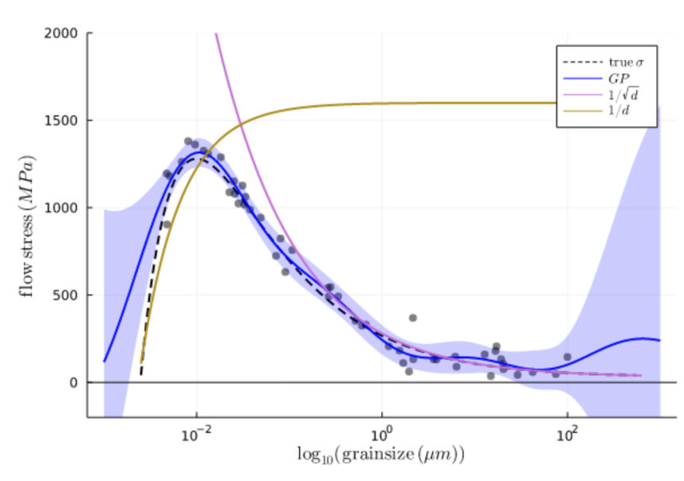

# Reflections on the future of machine learning for materials research

This repository contains code for reproducing the model interpretability illustration from Figure 2 of [arxiv:2112.09764](https://arxiv.org/abs/2112.09764)

